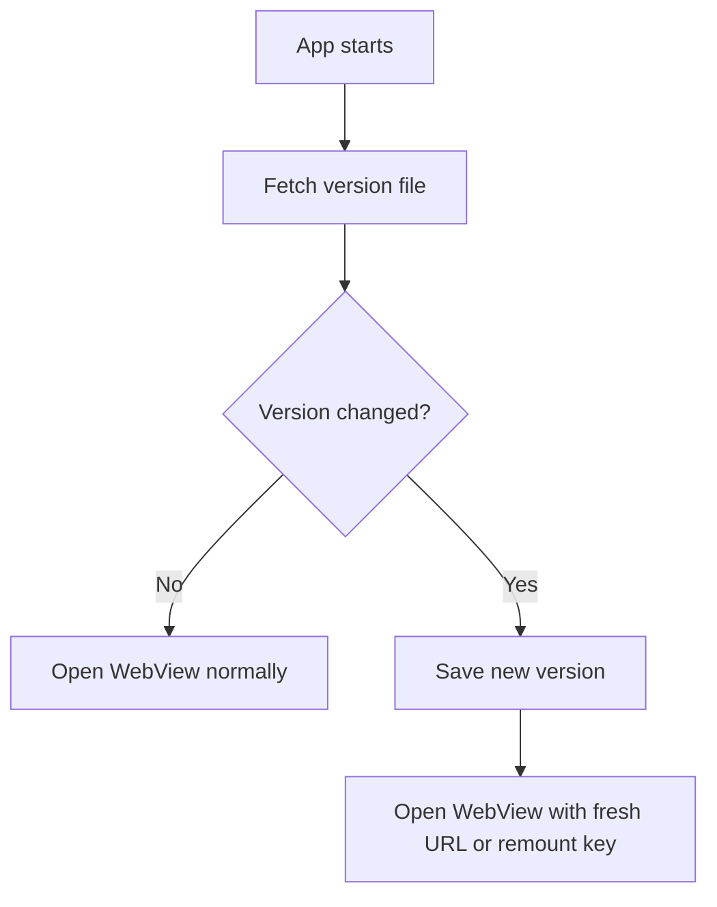

# WebView Preload Version Check Implementation Guide

## Objective

Prevent stale WebView content by checking the website version before the WebView screen opens. If the website changed, force the app to load the new version before showing the user the site.

This is the recommended approach for this project because the WebView should stay mounted for smooth navigation, but it still needs a reliable way to detect a new website deployment.

## High-Level Plan

- Add a version file on the website.
- Check that version file before routing into the WebView screen.
- Compare the remote version with the last saved local version.
- If changed, mark the WebView as needing a refresh and open it with a cache-busting URL or a remount key.
- If unchanged, open the WebView normally.

## Website Requirements

The website must expose a stable version file at a fixed URL.

### Recommended Endpoint

- `https://your-domain.com/version.json`
- or `https://your-domain.com/webview-version.txt`

### Example JSON

```json
{
  "version": "2026-05-22-01"
}
```

### Example text file

```txt
2026-05-22-01
```

### Deployment Rule

Update the version value on every deployment. The value only needs to change when the site build changes.

## App Requirements

### 1. Run the check before opening the WebView

Do not rely only on the WebView screen itself. Run the version check in a higher-level place such as:

- `app/index.tsx`
- `app/_layout.tsx`
- a dedicated loading/splash route

The app should wait for the version check to finish before navigating into `/webview`.

### 2. Store the last known version locally

Use `AsyncStorage` to save the last seen version per mode.

Recommended keys:

- `webview_site_version_monitoring`
- `webview_site_version_maintainance`

### 3. Reload only when the version changes

If the remote version differs from the saved one:

- update the stored value,
- force a fresh WebView load,
- optionally append a cache-busting query parameter.

If the version is the same:

- open the WebView normally,
- do not reload the current page.

## Suggested App Flow



## Recommended Implementation Pattern

### Option A: Cache-busting query string

When version changes, open the WebView with a URL like:

```txt
https://your-domain.com/?wv_version=2026-05-22-01
```

Pros:

- simple,
- easy to debug,
- works well with many caches.

Cons:

- changes the visible URL,
- may not invalidate all client-side state.

### Option B: Force remount with a `key`

Pass a version-based key into the WebView component.

Example:

```tsx
<WebView key={siteVersion} source={{ uri: sourceUrl }} />
```

Pros:

- guarantees a fresh WebView instance.

Cons:

- discards all in-memory page state.

### Recommended for This App

Use the version check before navigation, then either:

- remount the WebView only when version changes, or
- attach a cache-busting query string when the site version changes.

The current project should avoid reloading on every screen open.

## Where to Put the Logic

### Best place

Use a small startup gate before redirecting to `/webview`.

Example flow:

1. App opens.
2. App checks version file.
3. App decides whether the site is fresh.
4. App redirects to `/webview` only after that decision.

### Avoid

Do not use the live WebView `source` URL as the update signal. That causes reload loops and stale state problems.

## Suggested Web Team Tasks

- Add `version.json` or `version.txt` to the deployed site.
- Make sure the version changes on every deploy.
- Ensure the file is not heavily cached by CDN or browser.
- If possible, serve it with a short cache lifetime or `no-cache` headers.

## Suggested App Team Tasks

- Add a version fetch before opening the WebView.
- Save the version in `AsyncStorage`.
- Compare remote vs stored version on app start.
- Only remount or refresh the WebView when the version changes.
- Keep the current mounted WebView behavior for ordinary navigation.

## Acceptance Criteria

- The app checks the version before opening the WebView.
- A new website deployment is detected on the next app open.
- The app does not flash stale cached content.
- The WebView does not reload on every navigation or every foreground event unless the version changed.
- Both `monitoring` and `maintainance` modes work independently if they use different source URLs.

## Notes

If the website is behind a CDN, make sure the version file is excluded from long-term caching. The app can only detect updates if it receives a fresh version value.

If the web team wants, the version file can be generated automatically during deployment from the build number, commit SHA, or deployment timestamp.
